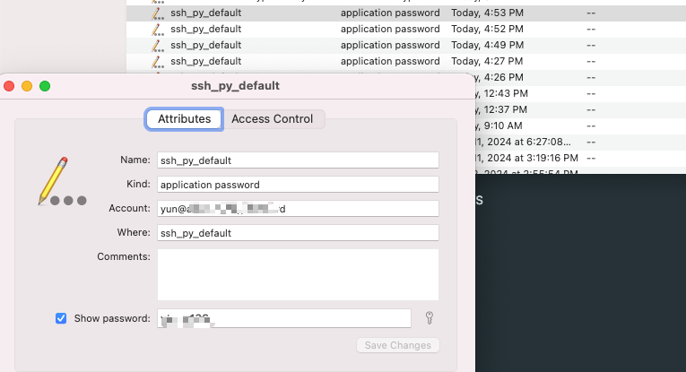

sshpky-zsh-plugin

====================

[oh-my-zsh plugin](https://github.com/robbyrussell/oh-my-zsh) for auto updating of git-repositories in $ZSH_CUSTOM folder

## Install

Create a new directory in `$ZSH_CUSTOM/plugins` called `autoupdate` and clone this repo into that directory. Note: it must be named `autoupdate` or oh-my-zsh won't recognize that it is a valid plugin directory.

```
git clone https://github.com/jeffzhangc/sshpky_zsh_plugin.git $ZSH_CUSTOM/plugins/sshpky
```

python3 is required

```
pip install keyring
pip install pexpect
```

## Usage

Add `sshpky` to the `plugins=()` list in your `~/.zshrc` file and you're done.

```bash
plugins=(sshpky)

# Multiple plugins should be separated by space character
# plugins=(somePlugin sshpky)
```

ssh remote host，use keyring to save password and auto input password from keychain;

use sshpky replace ssh to connect remote sshd server

如果 keychain 中没有找到密码，会提示输入，密码，登陆成功后，保存到 keychain

第二次登陆时，会从 keychain 中找密码

### 1. 记录使用密码登录

```
(base) ➜  ~ sshpky xx.3_75
Connecting cmd /usr/bin/ssh xx.3_75
Sending password
[ssh @xx.3_75 -p22 ]: successful login
 Fri Dec 27 11:20:41 2024 from 10.1.106.96

[xxx@xx-1.1.1.75 ~]
$
```

### 2. jumpserver 使用 google MFA

输入秘钥，会生成 6 位 code，如果登陆成功，记录到秘钥到 keychain

```
(base) ➜  ~ sshpky xxx-jumpserver
Connecting cmd /usr/bin/ssh xxx-jumpserver
google code : PCZEC3XDHKK0000 : 630000
[ssh @xxx-jumpserver -p22 ]: successful login
Opt>
  ID    | 主机名                                         | IP                    | 平台            | 组织            | 备注
--------+------------------------------------------------+-----------------------+-----------------+-----------------+--------------------------------
```



## reference

- [python sshpass](https://github.com/bdelliott/sshpass)
